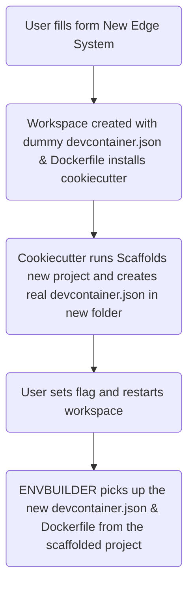

# Coder Bootstrapper

This module helps Edge Developers quickly start new Edge System or Edge UI projects in a
Coder workspace.

Coder uses "Envbuilder" and devcontainers to manage the workspace environment. When a
workspace is created for a new system, there isn’t yet a `devcontainer.json` or
`Dockerfile` in place.

This module solves that by introducing a temporary devcontainer with cookiecutter
pre-installed. When a new workspace is started, automated scripts can be used to run
cookiecutter to generate all the necessary project files and folders. Afterward, the
workspace can be restarted with a changed parameter, and the Coder environment will be
ready.

In short: This is a practical “bootstrapper” hack for spinning up new Edge Systems in
Coder.

## Flow Chart

